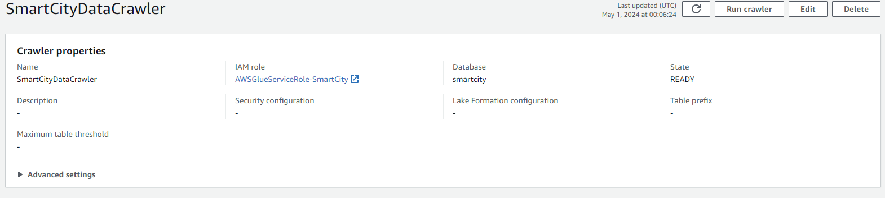

# End to End Realtime Data Engineering Project


## Overview
This project demonstrates an end-to-end ETL (Extract, Transform, Load) process using Apache Spark. It extracts data from various sources, performs transformations, and loads the processed data into a target destination.

## Technologies Used
- Apache Spark
- Python
- Kafka
- Docker
- AWS S3
- AWS GLue
- AWS Redshift
## Data Creation
The idea is to capture a vehicle realtime data travelliing from point A to point B. This data is create using python functions written in main.py.\
The important function involved in publishing data to kafka topic is:
```python
def simulate_journey(producer, device_id):
    while True:
        vehicle_data = generate_vehicle_data(device_id)                    # Dummy data is being generated.
        gps_data = generate_gps_data(device_id, vehicle_data['timestamp'])
        traffic_camera_data = generate_traffic_camera_data(device_id, vehicle_data['timestamp'],
                                                           vehicle_data['location'], 'Nikon-Cam123')
        weather_data = generate_weather_data(device_id, vehicle_data['timestamp'], vehicle_data['location'])
        emergency_incident_data = generate_emergency_incident_data(device_id, vehicle_data['timestamp'],
                                                                   vehicle_data['location'])

        if (vehicle_data['location'][0] >= BIRMINGHAM_COORDINATES['latitude']
                and vehicle_data['location'][1] <= BIRMINGHAM_COORDINATES['longitude']):
            print('Vehicle has reached Birmingham. Simulation ending...')
            break

        produce_data_to_kafka(producer, VEHICLE_TOPIC, vehicle_data)        #data is being published to VEHICLE_TOPIC.
        produce_data_to_kafka(producer, GPS_TOPIC, gps_data)
        produce_data_to_kafka(producer, TRAFFIC_TOPIC, traffic_camera_data)
        produce_data_to_kafka(producer, WEATHER_TOPIC, weather_data)
        produce_data_to_kafka(producer, EMERGENCY_TOPIC, emergency_incident_data)

        time.sleep(3)
```

## ETL Process
### 1. Docker Setup
As the first step I installed docker desktop and executed docker-compose.yml file to spin up containers required to execute this project.\
which include
- Kafka Server
- Zookeeper
- Spark-master
- Spark-worker1
- sparl-worker2
  


### 1. Data Extraction
- Step 1
  ```python
  spark = SparkSession.builder.appName("SmartCityStreaming")
  ```
  A spark session is created using SparkSession builder
  
- Step 2
  For each kafka topic a schema is created mainly used to subscribe the data published.
  ```pyton
  vehicleSchema = StructType([
        StructField("id", StringType(), True),
        StructField("deviceId", StringType(), True),
        StructField("timestamp", TimestampType(), True),
        StructField("location", StringType(), True),
        StructField("speed", DoubleType(), True),
        StructField("direction", StringType(), True),
        StructField("make", StringType(), True),
        StructField("model", StringType(), True),
        StructField("year", IntegerType(), True),
        StructField("fuelType", StringType(), True),
    ])
  ```
### 2. Data Transformation
  A function reads the kafka topic and creates a SparkDataframe when called.
  ```python
          def read_kafka_topic(topic, schema):
            return (spark.readStream
                    .format('kafka')
                    .option('kafka.bootstrap.servers', 'broker:29092')
                    .option('subscribe', topic)
                    .option('startingOffsets', 'earliest')
                    .load()
                    .selectExpr('CAST(value AS STRING)')
                    .select(from_json(col('value'), schema).alias('data'))
                    .select('data.*')
                    .withWatermark('timestamp', '2 minutes')
                    )
  
  vehicleDF = read_kafka_topic('vehicle_data', vehicleSchema).alias('vehicle')        # Here 'vehicle_data' is the kafka topic from which data is read.
  ```

### 3. Data Loading
- Step 1
  Create AWS S3 Bucket
    
    S3 bucket is created and required permissions are given for the spark aplication to write its data to S3. Here the data is converted to parquet format.
- Step 2
  ```python
      def streamWriter(input: DataFrame, checkpointFolder, output):
        return (input.writeStream
                .format('parquet')
                .option('checkpointLocation', checkpointFolder)
                .option('path', output)
                .outputMode('append')
                .start())
  ```
  This function takes Dataframe as input and reads the schematic data and writes it to AWS S3 bucket provided as argument.
  ```python
  query1 = streamWriter(vehicleDF, 's3a://spark-streaming-data01/checkpoints/vehicle_data',
                 's3a://spark-streaming-data01/data/vehicle_data')
  ```
- Step 3
  The data stored in S3 will be read by AWS Glue crawler and creadate a data catalog which can be made availabel to any data warehouse service for further data analysis or developments.
  



## Usage
To run the ETL process, follow these steps:
1. Clone the repository.
2. Set up the necessary dependencies.
3. Execute the extraction, transformation, and loading scripts in sequence.

## Conclusion
This README provides an overview of the ETL project, including its architecture, technologies used, and the ETL process. By following the provided instructions, users can run the ETL process and analyze the transformed data.

Feel free to customize this template according to your project's specific requirements and add additional sections as needed.
